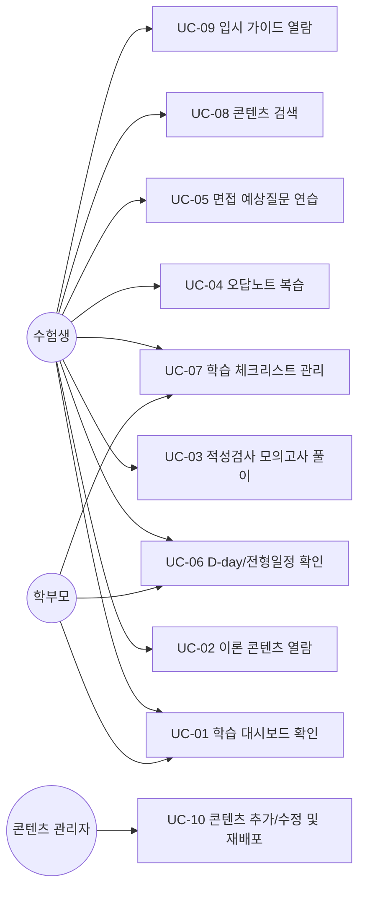

# 디미고 해킹방어과 입시 준비 사이트 — 유즈케이스 명세서

- 문서 버전: v1.0 (2026-07-30)
- 프로젝트명(가칭): **DIMIGO PREP** (디미고 해킹방어과 전형 대비 토털 솔루션)
- 목표 사용자: 2027학년도 디미고 해킹방어과 입학을 목표로 하는 중3 수험생 및 학부모
- 배포 형태: Static Web (Vercel 배포), 백엔드/서버 없음, 데이터는 브라우저 로컬(localStorage)에 저장

---

## 1. 프로젝트 개요

디미고(한국디지털미디어고등학교) 해킹방어과 진학을 목표로, 아래 3가지 전형 요소를 하나의 정적 웹사이트에서 **학습 → 실전 연습 → 복습**까지 순환할 수 있도록 지원한다.

1. **소질·적성검사 대비**: 정보교과 학업역량 · 수리추론 · 문제해결 · 창의융합 사고력 이론 학습 + 모의문제 풀이
2. **해킹방어과 특화 기초 이론**: 정보보호개론, 네트워크 기초, 웹/리버싱/포너블 입문 개념, 리눅스, C언어/알고리즘 기초
3. **면접 대비**: 예상 질문 은행 + 답변 연습(작성/타이머) + 자기소개서·실적물 정리
4. **입시 가이드 허브**: 앞서 정리한 「디미고 입시 준비 가이드」 내용을 사이트 내 상시 열람 가능한 페이지로 제공

## 2. 액터(Actor) 정의

| 액터 | 설명 |
|---|---|
| **수험생(주 사용자)** | 디미고 해킹방어과를 목표로 하는 중3 학생. 이론 학습, 모의고사 풀이, 면접 연습, 진도 확인을 수행 |
| **학부모(보조 사용자)** | 아들의 학습 진도를 함께 확인하고, 일정(D-day)·체크리스트를 관리 |
| **콘텐츠 관리자(개발자=부모, 운영 단계)** | 마크다운/JSON 파일로 문제·이론·질문 콘텐츠를 추가/수정하고 재배포(deploy)함. 별도 관리자 화면(Admin UI)은 두지 않고, 코드 저장소에서 직접 콘텐츠 파일을 편집하는 방식 |

> 이 사이트는 서버·로그인 기능이 없는 **static 사이트**이므로, "콘텐츠 관리자"는 별도 웹 UI가 아니라 저장소(GitHub 등)의 콘텐츠 파일을 편집하고 Vercel에 재배포하는 방식으로 동작한다. (자세한 내용은 「개발계획서」 참고)

## 3. 유즈케이스 다이어그램 (텍스트/Mermaid)

## 4. 유즈케이스 상세 명세

### UC-01. 학습 대시보드 확인
- **액터**: 수험생, 학부모
- **목적**: 오늘 무엇을 공부해야 하는지, 지금까지 진도가 얼마나 되었는지 한눈에 파악
- **사전조건**: 사이트 접속 (별도 로그인 불필요)
- **기본 흐름**:
  1. 사용자가 사이트 첫 화면(홈)에 접속한다.
  2. 시스템은 localStorage에 저장된 진도 데이터를 읽어 영역별(적성검사 이론/모의고사/해킹방어 이론/면접) 진행률을 카드 형태로 표시한다.
  3. D-day(디미고 전형 일정)와 최근 오답 요약, "오늘의 추천 학습"을 함께 노출한다.
- **예외 흐름**: 최초 접속 시 저장된 데이터가 없으면 진행률 0%로 표시하고 온보딩 가이드를 보여준다.
- **사후조건**: 사용자가 원하는 학습 영역으로 바로 이동 가능

### UC-02. 이론 콘텐츠 열람
- **액터**: 수험생
- **목적**: 적성검사/해킹방어과 관련 필요 이론을 카테고리별로 학습
- **기본 흐름**:
  1. 사용자가 상단 네비게이션 또는 대시보드에서 이론 카테고리(예: "네트워크 기초")를 선택한다.
  2. 시스템은 해당 카테고리의 목차(챕터 리스트)를 보여준다.
  3. 사용자가 챕터를 선택하면 마크다운 기반 본문(개념 설명, 그림/도식, 핵심 요약, 확인 문제 1~3개)을 렌더링한다.
  4. 챕터 하단의 "학습 완료" 버튼을 누르면 진도 데이터에 완료로 기록된다.
- **사후조건**: 대시보드의 진행률이 갱신됨

### UC-03. 적성검사 모의고사 풀이
- **액터**: 수험생
- **목적**: 실전과 유사한 형태(제한시간, 객관식/단답형 혼합)로 적성검사를 연습
- **사전조건**: 문제은행에 최소 1세트 이상의 모의고사 데이터 존재
- **기본 흐름**:
  1. 사용자가 "모의고사" 메뉴에서 세트(예: "수리추론 1회", "IT상식 1회", "종합 모의 1회")를 선택한다.
  2. 시스템은 타이머를 시작하고 문제를 순서대로 표시한다(이전/다음 이동 가능).
  3. 사용자가 모든 문제에 답하거나 시간이 종료되면 자동 채점한다.
  4. 결과 화면에 점수, 영역별 정답률, 오답 문제 목록과 해설을 표시한다.
  5. 사용자가 "오답노트에 저장"을 선택하면 UC-04와 연동된다.
- **예외 흐름**: 시간 종료 시 미응답 문항은 오답 처리하고 자동 제출
- **사후조건**: 결과가 localStorage에 회차별로 누적 저장되어 추이(그래프)를 확인 가능

### UC-04. 오답노트 복습
- **액터**: 수험생
- **목적**: 틀린 문제만 모아 반복 학습
- **기본 흐름**:
  1. 사용자가 "오답노트" 메뉴에 진입한다.
  2. 시스템은 지금까지 틀린 문제를 영역/최근순으로 정렬해 보여준다.
  3. 사용자가 문제를 다시 풀고, 맞히면 오답노트에서 자동 제외(또는 "복습 완료" 표시)된다.

### UC-05. 면접 예상질문 연습
- **액터**: 수험생
- **목적**: 카테고리별(지원동기/실적물·포트폴리오/진로계획/인성/시사) 예상 질문에 대한 답변을 미리 작성·정리하고 실전처럼 시간 재고 말해보는 연습
- **기본 흐름**:
  1. 사용자가 "면접 준비" 메뉴에서 질문 카테고리를 선택한다.
  2. 질문 목록과 각 질문의 "출제 의도/평가 포인트" 힌트를 확인한다.
  3. 답변 초안을 텍스트로 작성해 저장(localStorage)한다.
  4. "타임어택 모드"를 선택하면 질문이 무작위로 하나 제시되고 60~90초 카운트다운 타이머가 동작해 실전 감각을 익힌다.
- **사후조건**: 작성한 답변은 다음 방문 시에도 유지되어 계속 다듬을 수 있음

### UC-06. D-day / 전형 일정 확인
- **액터**: 수험생, 학부모
- **목적**: 전형 일정(원서접수, 1단계 발표, 적성검사·면접일 등)까지 남은 기간을 확인
- **기본 흐름**:
  1. 사이트 상단 또는 대시보드에 D-day 위젯이 표시된다.
  2. "전형 일정" 페이지에서 단계별 일정표(타임라인)를 확인한다.
- **비고**: 2027학년도 확정 요강 발표 전까지는 "예정(가안)" 표시를 유지하고, 확정 시 콘텐츠 관리자가 값을 갱신한다.

### UC-07. 학습 체크리스트 관리
- **액터**: 수험생, 학부모
- **목적**: 「디미고 입시 준비 가이드」의 체크리스트(내신관리, IT상식 스크랩, 코딩 학습, 자기소개서 정리 등)를 사이트에서 직접 체크
- **기본 흐름**:
  1. 사용자가 체크리스트 페이지에서 항목을 확인한다.
  2. 완료 항목에 체크하면 localStorage에 저장되고, 대시보드 진행률에도 반영된다.

### UC-08. 콘텐츠 검색
- **액터**: 수험생
- **목적**: 특정 키워드(예: "버퍼오버플로우", "XSS")로 이론/문제/면접질문을 한 번에 검색
- **기본 흐름**:
  1. 사용자가 상단 검색창에 키워드를 입력한다.
  2. 클라이언트 사이드 검색(정적 인덱스 기반)으로 결과를 즉시 표시한다.

### UC-09. 입시 가이드 열람
- **액터**: 수험생, 학부모
- **목적**: 이전에 작성된 「디미고 입시 준비 가이드」 전체(전형 구조, 학과 소개, 준비 시기 등)를 사이트 내에서 언제든 확인
- **기본 흐름**:
  1. 사용자가 "입시 가이드" 메뉴에 진입한다.
  2. 목차를 통해 원하는 섹션(전형 종류/평가 항목/적성검사/면접/체크리스트 등)으로 이동한다.

### UC-10. 콘텐츠 추가/수정 및 재배포 (운영 유즈케이스)
- **액터**: 콘텐츠 관리자
- **목적**: 새로운 기출/예상문제, 이론, 면접질문을 추가하거나 전형 일정 확정본을 반영
- **기본 흐름**:
  1. 관리자가 로컬(또는 Claude Code)에서 `content/` 폴더 내 마크다운/JSON 파일을 추가·수정한다.
  2. Git에 커밋 후 원격 저장소로 push한다.
  3. Vercel이 저장소 변경을 감지해 자동 빌드·배포한다.
  4. 배포 완료 후 실사이트에서 반영 여부를 확인한다.
- **비고**: 별도 관리자 인증 화면 없이, 저장소 접근 권한 자체가 접근 통제 수단이 된다.

## 5. 유즈케이스 우선순위 요약

| 유즈케이스 | 우선순위 | 비고 |
|---|---|---|
| UC-01 대시보드 | Must | MVP 필수 |
| UC-02 이론 열람 | Must | MVP 필수 |
| UC-03 모의고사 풀이 | Must | MVP 필수, 핵심 기능 |
| UC-04 오답노트 | Should | 2차 개발 |
| UC-05 면접 연습 | Must | MVP 필수 |
| UC-06 D-day | Should | 간단하지만 체감 효과 큼 |
| UC-07 체크리스트 | Should | 가이드 이식과 함께 진행 |
| UC-08 검색 | Could | 콘텐츠 양이 늘어난 후 추가 |
| UC-09 입시 가이드 열람 | Must | 기존 산출물 재사용, 구현 난이도 낮음 |
| UC-10 콘텐츠 관리 | Must | 운영 지속을 위한 필수 프로세스 |
